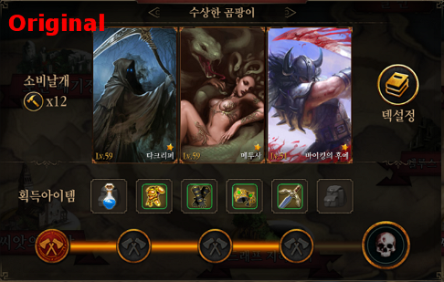
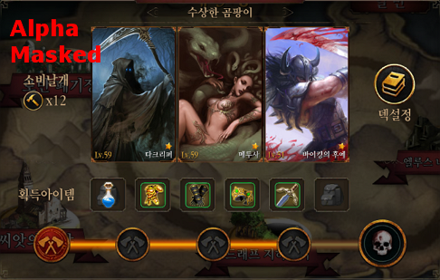

Unity-NGUIExtension
===================

Various NGUI extension modules.

Modules
-------
* **UIShaderSprite** - It enables to apply and specify shader on each of sprite in the atlas. (It will work on NGUI 3.7.0 or higher version)

* **Alpha Masked shader** - It enables to use compressed image format for an Atlas image file, PVRTC on iOS and ETC on Android. Both of format are 4bits so it reduces image size to 1/4. Inspired by [unity-alphamask](https://github.com/keijiro/unity-alphamask). See also [Texture Compression](http://egloos.zum.com/littles/v/3439290)(*Korean only*) for more details about benefit of using PVRTC on iOS and ETC1 on Android device.

The problem of using alpha maksed image approach can be found on a translucent sprite. Using alpha-masked approach is not good for a translucent sprite image. An image can be more translucent than it should be rendered due to its lack of color pixels. Compare the following images:

  

     

When all sprites of atals images are rendred with alpha masked 4bit images, the second image, the differences are subtle except windows background sprite.  So it is highly recommanded to use RGBA32 format, especially for a GUI sprite if the sprite image is translucent one.

All the sprite images of Alpha-Masked are made with NGUI and rendered with *Transparent Colored Masked.shader* in this repository. Surely its atlas image size is reduced up to 1/4 and very good strategy for reducing image size such as equipment icon sprite images.

References
-----------

Other useful NGUI modules found on github.

* [NGUI Additions](https://github.com/yeticrabgames/NGUIAdditions)
* [MateNGUI](https://github.com/ddionisio/MateNGUI)
* [DataBinderForNGUI](https://github.com/kyubuns/DataBinderForNGUI)
* [UIUnityRenderer](https://github.com/tarob19/UIUnityRenderer) manages NGUI widgets to use that together with other gameobjects which contain ParticleSystem or MeshRenderer by its depth.